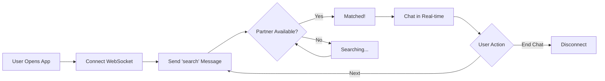

# ChatMe - Anonymous Random Chat App

<div align="center">

🎉 **Backend and Frontend are now fully integrated!** 🎉

Real-time anonymous chat with WebSocket communication

[Quick Start](#-quick-start) • [Features](#-features) • [Documentation](#-documentation) • [Deploy](#-deployment)

</div>

---

## 📱 Overview

ChatMe is an anonymous random chat application where users can connect with strangers worldwide in real-time. No registration required, just tap and start chatting!

### Tech Stack

**Frontend:**
- React Native 0.82.1
- TypeScript
- WebSocket (Native API)
- Custom hooks for state management

**Backend:**
- Cloudflare Workers
- Durable Objects
- WebSocket (Cloudflare API)
- Queue-based matching algorithm

---

## ✨ Features

### Core Features
- 🔒 **Anonymous** - No login, no registration
- ⚡ **Real-time** - Instant message delivery via WebSocket
- 🌍 **Random Matching** - Queue-based algorithm pairs users
- 🔄 **Skip Partner** - Find new chat partners with "Next" button
- 📱 **Cross-platform** - iOS and Android support
- 🎨 **Modern UI** - Beautiful animations and smooth UX

### Technical Features
- ✅ Auto-reconnection on network loss
- ✅ Keep-alive mechanism (ping/pong)
- ✅ Connection state management
- ✅ Partner tracking
- ✅ Message synchronization
- ✅ Graceful error handling
- ✅ App backgrounding support

---

## 🚀 Quick Start

### Prerequisites
- Node.js >= 20
- Cloudflare account (free tier works)
- React Native environment setup

### 3-Step Setup

```bash
# 1. Deploy Backend
cd chatme-backend
npm install
npx wrangler login
npx wrangler deploy
# Copy the URL shown

# 2. Configure Frontend
# Edit: chatme-app/src/config/index.ts
# Update: WEBSOCKET_URL to your backend URL (use wss://)

# 3. Run App
cd chatme-app
npm install
npm run ios  # or npm run android
```

**Detailed guide:** See [QUICK_START.md](./QUICK_START.md)

---

## 📖 Documentation

| Document | Description |
|----------|-------------|
| [QUICK_START.md](./QUICK_START.md) | Fast setup for testing |
| [INTEGRATION_GUIDE.md](./INTEGRATION_GUIDE.md) | Complete integration guide |
| [MESSAGE_FLOW.md](./MESSAGE_FLOW.md) | WebSocket message flow |
| [IMPLEMENTATION_SUMMARY.md](./IMPLEMENTATION_SUMMARY.md) | What was built |

---

## 🏗️ Project Structure

```
chatme/
├── chatme-backend/           # Cloudflare Worker backend
│   ├── src/
│   │   ├── index.ts         # Worker entry point
│   │   ├── chatqueue.ts     # Durable Object with queue logic
│   │   └── types.ts         # Message type definitions
│   ├── wrangler.jsonc       # Cloudflare configuration
│   └── package.json
│
└── chatme-app/              # React Native frontend
    ├── src/
    │   ├── screens/         # UI screens
    │   │   ├── SplashScreen.tsx
    │   │   ├── HomeScreen.tsx
    │   │   └── ChatScreen.tsx    [✓ WebSocket integrated]
    │   ├── hooks/           # Custom React hooks
    │   │   └── useChatWebSocket.ts  [NEW]
    │   ├── types/           # TypeScript types
    │   │   └── websocket.ts        [NEW]
    │   ├── config/          # App configuration
    │   │   └── index.ts            [NEW]
    │   ├── constants/       # Colors, theme
    │   ├── assets/          # Images
    │   └── components/      # Reusable components
    ├── App.tsx
    └── package.json
```

---

## 🔌 WebSocket Integration

### Connection Flow



### Message Types

**Client → Server:**
```typescript
{ type: 'search' }              // Find partner
{ type: 'message', text: '...' } // Send message
{ type: 'end_chat' }            // Disconnect
{ type: 'ping' }                // Keep-alive
```

**Server → Client:**
```typescript
{ type: 'searching' }                        // In queue
{ type: 'matched', partnerId: '...' }        // Matched
{ type: 'message', text: '...', from: '...' } // Received message
{ type: 'partner_disconnected' }             // Partner left
{ type: 'pong' }                             // Keep-alive response
```

---

## 🧪 Testing

### Run Two Instances

**iOS Simulators:**
```bash
# Terminal 1
npx react-native run-ios --simulator="iPhone 15"

# Terminal 2
npx react-native run-ios --simulator="iPhone 15 Pro"
```

**Android Emulators:**
```bash
# Terminal 1
npm run android

# Terminal 2 (with second emulator running)
npx react-native run-android --deviceId=emulator-5556
```

### Test Checklist
- [ ] Both devices connect
- [ ] Matching occurs
- [ ] Messages send/receive
- [ ] "Next" finds new partner
- [ ] "End Chat" disconnects
- [ ] Reconnection after network loss

---

## 🚀 Deployment

### Backend (Cloudflare Workers)

```bash
cd chatme-backend
npx wrangler deploy
```

Monitor logs:
```bash
npx wrangler tail
```

View dashboard: https://dash.cloudflare.com

### Frontend (React Native)

**iOS:**
1. Open `chatme-app/ios/ChatMe.xcworkspace` in Xcode
2. Select target device/simulator
3. Update bundle identifier and signing
4. Build and run (Cmd + R)

**Android:**
1. Open `chatme-app/android` in Android Studio
2. Update app ID in `build.gradle`
3. Generate signed APK (Build → Generate Signed Bundle/APK)
4. Distribute via Google Play or direct APK

---

## ⚙️ Configuration

### WebSocket URL

Edit `chatme-app/src/config/index.ts`:

```typescript
export const Config = {
  WEBSOCKET_URL: 'wss://your-backend.workers.dev',  // UPDATE THIS
  RECONNECT_INTERVAL: 3000,
  MAX_RECONNECT_ATTEMPTS: 5,
  PING_INTERVAL: 30000,
} as const;
```

### Local Development

For local testing with `wrangler dev`:

```typescript
WEBSOCKET_URL: __DEV__ && true
  ? 'ws://localhost:8787'  // Local (change to true)
  : 'wss://your-backend.workers.dev',  // Production
```

**Android Note:** Use your computer's IP instead of `localhost`:
```typescript
'ws://192.168.1.x:8787'  // Replace with your IP
```

---

## 🐛 Troubleshooting

### Connection Issues

**Problem:** WebSocket won't connect

**Solutions:**
- Verify backend is deployed: Visit URL in browser
- Check URL in config uses `wss://` (not `https://`)
- For local testing, ensure `wrangler dev` is running
- For Android local, use IP address not `localhost`

### Matching Issues

**Problem:** Stuck on "Searching..."

**Solutions:**
- Need 2+ users searching simultaneously
- Try opening second simulator/device
- Check backend logs with `npx wrangler tail`

### Message Issues

**Problem:** Messages not sending

**Solutions:**
- Verify status shows "Online" (not "Searching...")
- Check console logs for errors
- Confirm partner is still connected

---

## 📊 Monitoring

### Backend Logs
```bash
cd chatme-backend
npx wrangler tail
```

### Frontend Logs
- React Native: Metro bundler console
- iOS: Xcode console
- Android: Logcat/Android Studio

### Cloudflare Dashboard
- Analytics: Request count, errors
- Logs: Real-time WebSocket events
- Durable Objects: Storage and compute usage

---

## 🔐 Security

### Current
- ✅ Anonymous (no user data)
- ✅ Secure WebSocket (wss://)
- ✅ No message persistence
- ✅ Ephemeral sessions

### Recommended
- ⚠️ Rate limiting
- ⚠️ Content moderation
- ⚠️ User reporting
- ⚠️ CAPTCHA/bot prevention

---

## 💡 Future Enhancements

### Phase 1
- [ ] Typing indicators
- [ ] Read receipts
- [ ] Message timestamps
- [ ] Sound notifications
- [ ] Emoji reactions

### Phase 2
- [ ] Interest-based matching
- [ ] Image/GIF sharing
- [ ] Chat history (local)
- [ ] Profanity filter
- [ ] User preferences

### Phase 3
- [ ] Video chat
- [ ] Group chats
- [ ] Location-based matching
- [ ] Web version
- [ ] Analytics dashboard

---

## 📝 License

MIT License - See LICENSE file

---

## 🙏 Acknowledgments

Built with:
- React Native
- Cloudflare Workers & Durable Objects
- WebSocket Protocol
- TypeScript

---

## 📞 Support

For help and documentation:
- [Quick Start Guide](./QUICK_START.md)
- [Integration Guide](./INTEGRATION_GUIDE.md)
- [Message Flow Documentation](./MESSAGE_FLOW.md)
- [Implementation Summary](./IMPLEMENTATION_SUMMARY.md)

---

<div align="center">

**Made with ❤️ for anonymous chatting**

🌍 Connect with strangers worldwide • 💬 Chat anonymously • 🚀 Built with modern tech

</div>

