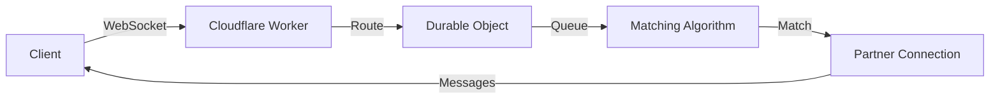

# ChatMe 💬

<div align="center">

🔒 **Anonymous Real-Time Chat Platform**

Connect with random strangers worldwide through secure WebSocket communication

[Quick Start](#-quick-start) • [Features](#-features) • [Documentation](#-documentation) • [Architecture](#-architecture)


</div>

---

## 📱 Overview

ChatMe is a modern anonymous chat platform that connects users with random strangers in real-time. Built with cutting-edge web technologies, it offers seamless cross-platform experience on web and mobile.

**No registration • No data collection • Complete anonymity**

---

## ✨ Features

### Core Features
- 🔒 **Anonymous Chatting** - No login or registration required
- ⚡ **Real-Time Messaging** - Instant WebSocket-based communication
- 🌍 **Global Matching** - Queue-based algorithm pairs users worldwide
- 🔄 **Smart Reconnection** - Automatic reconnection with exponential backoff
- 📱 **Cross-Platform** - Web app and native mobile apps (iOS & Android)

### Technical Features
- 🎨 Modern UI with glassmorphism and dark/light themes
- 🔐 API key authentication and CORS protection
- 🚀 Edge computing with Cloudflare Workers
- 💾 Stateful connections with Durable Objects
- 🎭 Emoji support and quick reactions
- 📊 Environment-aware logging system

---

## 🏗️ Project Structure

```
chatme/
├── chatme-web/          # React web application
│   └── README.md        # Web app documentation
├── chatme-app/          # React Native mobile application
│   └── README.md        # Mobile app documentation
└── chatme-backend/      # Cloudflare Workers backend
    └── README.md        # Backend documentation
```

### Projects

| Project | Description | Tech Stack |
|---------|-------------|------------|
| **[Web App](./chatme-web)** | React-based web application | React 19, TypeScript, Vite, Framer Motion |
| **[Mobile App](./chatme-app)** | Native mobile application | React Native 0.82, TypeScript |
| **[Backend](./chatme-backend)** | WebSocket server | Cloudflare Workers, Durable Objects |

---

## 🚀 Quick Start

### Prerequisites
- Node.js 20+
- npm or yarn
- Cloudflare account (for backend deployment)
- Android Studio or Xcode (for mobile development)

### Setup

1. **Clone the repository**
   ```bash
   git clone https://github.com/yourusername/chatme.git
   cd chatme
   ```

2. **Choose your platform**
   
   Each project has its own detailed setup guide:
   - **[Web App Setup →](./chatme-web/README.md)** - For web development
   - **[Mobile App Setup →](./chatme-app/README.md)** - For iOS/Android development
   - **[Backend Setup →](./chatme-backend/README.md)** - For deploying the server

### Quick Test (All Platforms)

```bash
# 1. Start Backend
cd chatme-backend
npm install
npx wrangler dev

# 2. Start Web App (in new terminal)
cd chatme-web
npm install
npm run dev

# 3. Start Mobile App (in new terminal)
cd chatme-app
npm install
npm run android  # or npm run ios
```

---

## 🛠️ Tech Stack

### Frontend
- **Web**: React 19, TypeScript, Vite, Framer Motion
- **Mobile**: React Native 0.82, TypeScript
- WebSocket API for real-time communication
- Environment-aware logging
- Modern UI with animations

### Backend
- **Cloudflare Workers** - Serverless edge computing
- **Durable Objects** - Stateful WebSocket connections
- TypeScript
- Queue-based matching algorithm
- Persistent state with hibernation support

---

## 📖 Documentation

### Project-Specific Guides
- **[Web App Documentation](./chatme-web/README.md)** - Setup, development, and deployment
- **[Mobile App Documentation](./chatme-app/README.md)** - Environment setup, building, and testing
- **[Backend Documentation](./chatme-backend/README.md)** - API, deployment, and monitoring

### Additional Resources
- [Quick Start Guide](./QUICK_START.md) - Fast setup for testing
- [Integration Guide](./INTEGRATION_GUIDE.md) - Complete integration walkthrough
- [Message Flow](./MESSAGE_FLOW.md) - WebSocket message protocol
- [Implementation Summary](./IMPLEMENTATION_SUMMARY.md) - Architecture overview

---

## 🔌 Architecture

### Connection Flow



### Message Protocol

**Client → Server:**
- `search` - Find a chat partner
- `message` - Send text/emoji
- `end_chat` - Disconnect
- `ping` - Keep-alive

**Server → Client:**
- `searching` - In queue
- `matched` - Partner found
- `message` - Received message
- `partner_disconnected` - Partner left
- `pong` - Keep-alive response

---

## 🔐 Security

- ✅ API key authentication for all connections
- ✅ CORS protection with whitelisted origins
- ✅ Secure environment variable management
- ✅ No message persistence (privacy-first)
- ✅ Anonymous sessions (no user data collected)

---

## 🎯 Roadmap

### Phase 1 - Core Features
- [x] Anonymous chat
- [x] Real-time messaging
- [x] Partner matching
- [x] Web and mobile apps
- [x] Secure WebSocket communication

### Phase 2 - Enhancements
- [x] Image/GIF sharing
- [ ] Typing indicators

### Phase 3 - Advanced
- [ ] Voice messages
- [ ] Video chat support
- [ ] End-to-end encrypted chat

---

## 🧪 Testing

### Run Multiple Instances

**Web:**
```bash
# Open multiple browser tabs at http://localhost:5173
```

**Mobile:**
```bash
# iOS - Two simulators
npx react-native run-ios --simulator="iPhone 15"
npx react-native run-ios --simulator="iPhone 15 Pro"

# Android - Two emulators
npm run android
npx react-native run-android --deviceId=emulator-5556
```

### Test Checklist
- [ ] Connection establishment
- [ ] Partner matching
- [ ] Message sending/receiving
- [ ] "Next" button (find new partner)
- [ ] "End Chat" button (disconnect)
- [ ] Reconnection after network loss
- [ ] Cross-platform compatibility

---

## 📊 Monitoring

### Backend Logs
```bash
cd chatme-backend
npx wrangler tail
```

### Cloudflare Dashboard
- Analytics: Request count, errors, latency
- Logs: Real-time WebSocket events
- Durable Objects: Storage and compute usage

---

## 🤝 Contributing

Contributions are welcome! Please follow these steps:

1. Fork the repository
2. Create your feature branch (`git checkout -b feature/AmazingFeature`)
3. Commit your changes (`git commit -m 'Add some AmazingFeature'`)
4. Push to the branch (`git push origin feature/AmazingFeature`)
5. Open a Pull Request

---

## 📄 License

MIT License - See [LICENSE](./LICENSE) file for details

---

## 🙏 Acknowledgments

- Inspired by Omegle and other anonymous chat platforms
- Built with React, React Native, and Cloudflare Workers
- Special thanks to the open-source community

---

<div align="center">

**Made with ❤️ for anonymous chatting**

🌍 Connect worldwide • 💬 Chat anonymously • 🚀 Built with modern tech

⭐ **Star this repo if you find it helpful!**

</div>
